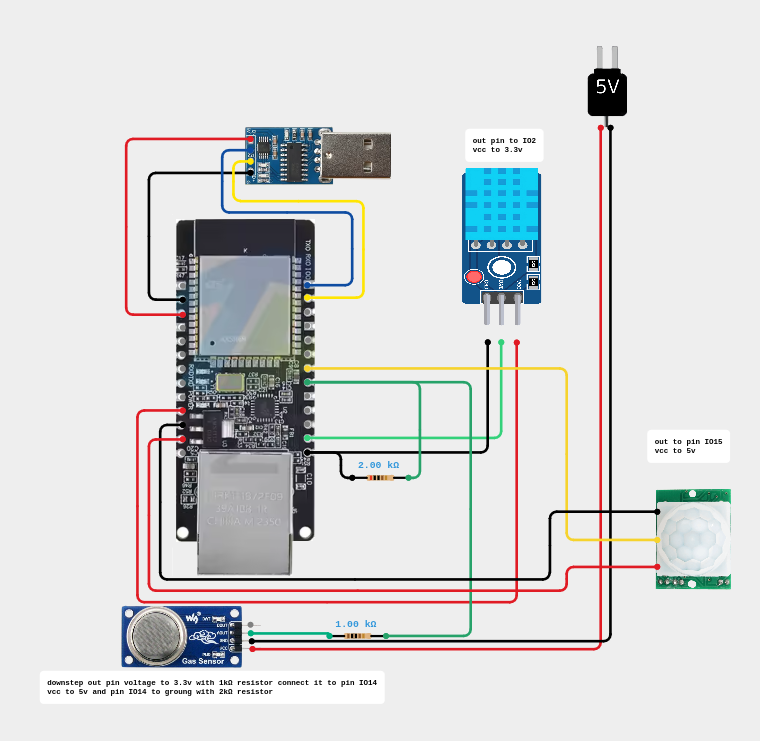

# Monitoring system

An enterprise-grade IoT environmental monitoring system powered by the WT32-ETH01 development board. This solution is specifically engineered for critical infrastructure environments, including server rooms, network closets, and datacenter racks hosting production switches and firewalls. 

The system mitigates operational risks by providing real-time telemetry to detect early-stage electrical fires, equipment overheating, and unauthorized physical access, streaming all collected metrics securely to a localized visualization platform.

## System Architecture

The system utilizes a lightweight, event-driven architecture designed for high availability and low latency over a wired industrial network.



### Component Breakdown

* **Edge Compute & Data Collection**: A **WT32-ETH01** (ESP32-based module with an integrated LAN8720 Ethernet chip) serves as the hardware core. It aggregates environment metrics from three dedicated sensors:
  * **DHT11**: Tracks ambient temperature and humidity to catch cooling system failures.
  * **MQ-2**: Monitors combustible gases and dense smoke for early fire detection.
  * **HC-SR501**: Detects physical presence to flag unauthorized cabinet access.
* **Message Broker**: A localized **Mosquitto MQTT** instance handles incoming sensor data payloads. It provides a lightweight, decoupled pub/sub layer, isolation, and guaranteed message delivery.
* **Ingestion Pipeline**: **Telegraf** acts as the data consumer. It subscribes to the Mosquitto MQTT topic, parses the incoming sensor metrics on the fly, and buffers them for batch insertion.
* **Database**: **InfluxDB** stores the ingested data as time-series metrics. It is highly optimized for timestamped infrastructure logs and rapid historical lookups.
* **Visualization Layer**: A local **Grafana** instance queries InfluxDB to display real-time telemetry, historical trends, and trigger administrative system alerts.

---

## Server Infrastructure Deployment

The server stack (Mosquitto, Telegraf, InfluxDB, and Grafana) is fully containerized using Docker Compose.

### Prerequisites
Ensure you have Docker and Docker Compose installed on your host machine/VM.

### Spinning up the Server
1. Navigate to the bachend folder:
   ```bash
   cd backend
   ```
2. Run the deployment command:
   ```bash
   docker compose up -d
   ```
3. Access the platforms in your browser:
   * **InfluxDB Dashboard**: `http://localhost:8086`
   * **Grafana Dashboards**: `http://localhost:3000`
